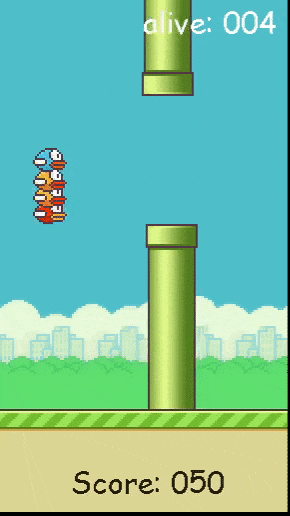
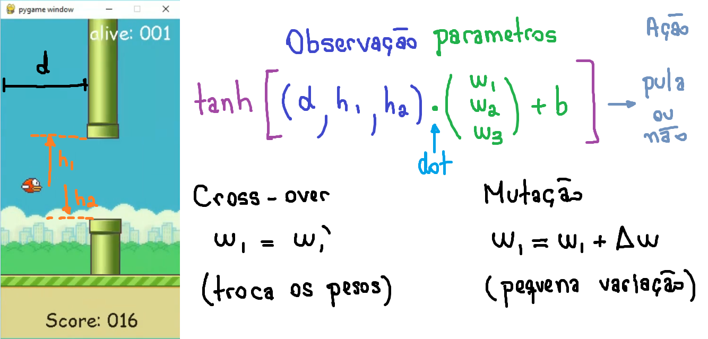

# FlappyBird-bot
Projeto originalmente concebido em 2017, o Flappy Bird bot foi resgatado em 2021 pelos membros do Capitulo de Computação do IEEE USP de São Carlos.



Baseado no método de otimização `Algoritmo Genético`, cada passaro possui uma lógica de decisão ligeiramente diferente dos outros. E a cada geração, os melhores são selecionados para continuar a população, até que no final da seleção eles sejam capazes de completar quase com perfeição o jogo.



Cada passaro recebe do jogo informações referentes a sua posição relati va ao próximo cano:
* `d` é a distancia horizontal entre o passaro e o cano, 
* `h1` é a distancia vertical ao cano de cima enquanto 
* `h2` é a distancia verical ate o cano de baixo

A lógica de decisão é equivalente ao calculo feito por uma rede neural de uma unica camada com um unico neuronio. Os pesos são:

<p align="center">
    
    </p>

<p align="center">
 0.5 \Rightarrow Pula}">
</p>

* `cross_over:` 2 individuos selecionados trocam entre si os valores de um de seus pesos
* `mutation:` o valor do peso é ligeiramente modificado somando-se um valor aleatorio

## Para rodar o jogo:
run: 
```
pip install requirements.txt
```

run:
```
python myflap2.py
```

## Disclaimer:
Flappy Bird belongs to it's original creators and we don't claim ownership over it
